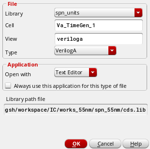
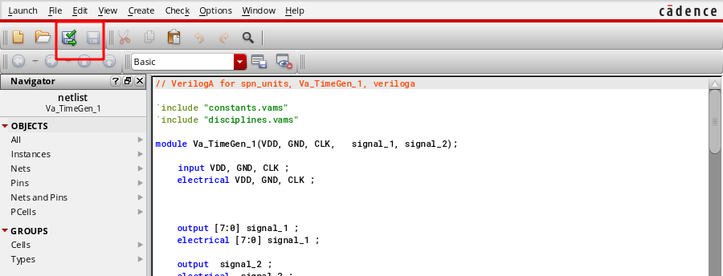
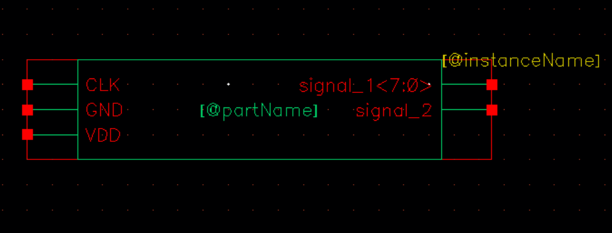
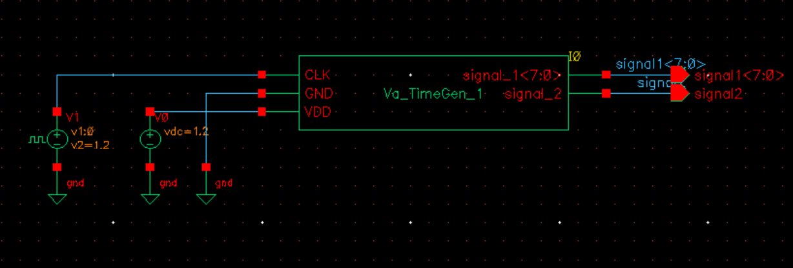
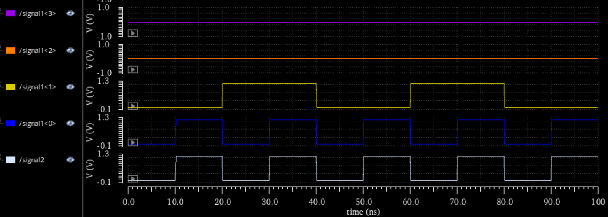

# The Verilog-A code generator

## Usage

1. modify the args in the main.py
2. `python main.py`

## Description

The codes are used to generate the VerilogA code which can be directly used in the `spectre simulation` .

The generated VerilogA code's fuction is to generate the specific waveforms according to your setting.

And the setting is done in the python code (`main.py`), which will facilitate greatly the coding works.

## Special Notes

Due to the limit of the type integer holding values ranging from -2^31 to 2^31 - 1, the with of the input signal `should not exceed 32` !!! If the signal's width > 32, you'd better split the signal into 2 signals.

## Demo

The code below is the description about the waveform in `python` , including the `I/O path`, `comment`, `module_name` and `waveforms info` .

```python
# input template file path
template_path ='./template.va'
# output file path
save_path = './generate.va'

# the comment in the veriloga file
comment = 'This file is generated by the VA_GEN .'
# the module name
module_name = 'Va_TimeGen_1'

# the expected output signals 
# signal-name | signal-width | waves-length | waves-value 
signal_args = [
    ['signal_1', 8, 4, [0, 1, 2, 3]],
    ['signal_2', 1, 4, [0, 1, 0, 1]]
]
```

The detailed meaning of the wavefoms info list is in the table below. The `signal_args` must contain at least 1 signal array.

|         | signal[0]  | siganl[1]  | signal[2]     | signal[3]         |
| ------- | ---------- | ---------- | ------------- | ----------------- |
| meaning | port name  | port width | waves' length | waves' values     |
| example | 'signal_1' | 8          | 4             | [0, 255, 128, 20] |

When you have done the setting, you can execute `python main.py` to get the VerilogA code.

And then you can open the `virtuoso` and create a Verilog-A cell.

> Note !!! The `cell name` must be consistent with the `module_name` in you setting.



Then you can use the editor to open the VerilogA file and copy the generated content to it.

Last, you can build the VerilogA.



If it goes well, the window will jump up. And you can enter `yes` to automatically genrate the symbol.


The symbol is just like this.



And you can invoke the VerilogA cell easily like this.

> Note !!! The wave's `frequency` is consistent with the input clk frequency and the `amplitude` is consisitent with the input VDD-GND. So you must give the `CLK, VDD and GND` signals when invoking the module.



The simulation result is as below.


